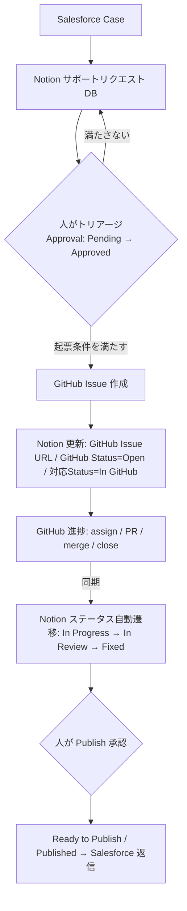

# Salesforce → Notion → GitHub 連携エージェント 設計書

このドキュメントは **Salesforce → Notion → GitHub 連携エージェント**（Notion カスタムエージェント）の設計書兼セットアップガイドです。
カスタムエージェントの **Instructions / Triggers / Tools and access** の 3 設定に、それぞれ何を入れるかをまとめています。

---

## 1. 目的とコンセプト

- Salesforce から Notion に連携された顧客サポートリクエストを、**Notion 上で人がトリアージ・承認してから** GitHub に起票する。
- Salesforce のものを自動で全部 GitHub に流すと開発チームがノイズだらけになるため、**人の承認ゲート**を挟む。
- GitHub 上の進捗（Issue / PR / Label / Assignee / Milestone）を Notion に**双方向同期**する。

> **重要ポイント**: GitHub で Closed になっても、すぐに Salesforce へ返信しない。
> 顧客に伝えてよい内容か・リリース済みか・説明文が適切かを **Notion 上で人が承認**するまで、返信・公開は自動化しない。

---

## 2. 全体フロー



---

## 3. Tools and access（接続とアクセス設定）

> ✅ **対象 DB (`📥 Product Requests DB` / `f8b5709430f24ef4a476fd50bf11aed1`) への読み書きアクセスは付与済み。**
> データソース: `collection://f633e1d9-ce9c-47fa-b009-15237d2afd4c`。実プロパティ名・選択肢で本設計を確定済み（§15 参照）。

必要な接続:

- **Notion**: サポートリクエスト DB への読み書きアクセス。
- **GitHub**: `AoiNotion/Aoi_test`（Issue の作成 / 更新 / コメント / ラベル / アサイン / クローズ、PR・Milestone の状態取得）。

---

## 4. Triggers（トリガー設定）

1. **Notion DB 変更トリガー（メイン）**: `Approval` が **Pending → Approved** に変わったとき → 起票判定を実行。
2. **Notion DB 変更トリガー（逆方向）**: `Priority` / `Product Area` / `Engineering Owner` / `Acceptance Criteria` / `対応Status`（Rejected・Needs Info・Duplicate 等）の変更 → GitHub 側を操作。
3. **GitHub 進捗の取り込み**: GitHub Webhook（Issue / PR / Label / Assignee / Milestone / Comment）でエージェントを起動、または一定間隔のスケジュールトリガーでポーリングして Notion に反映。

---

## 5. GitHub Issue 起票条件

起票のトリガーは **`Approval` が Pending → Approved に変わったとき**。あわせて以下を **すべて** 満たす行だけ起票する。1 つでも欠ける場合はスキップ。

- Approval が **Pending → Approved** に変化した（＝起票トリガー）
- GitHub Issue URL が **空**（＝二重起票防止のキー）
- Request Type ∈ { **Bug** / **Feature Request** / **Improvement** }

---

## 6. フィールドマッピング（Notion → GitHub Issue）

| Notion | GitHub |
| --- | --- |
| Request | Issue title |
| Engineering Brief | Issue body（独立プロパティは無く、実体はページ本文。空のことが多い） |
| Priority | Label (`priority:*`) |
| Product Area | Body に記載（自由記述のため Area ラベルは付与しない） |
| Request Type | Label (`type:*`) |
| Customer Impact | Label (`impact:*`) |
| Internal Owner | ユーザーマッピング未確定のため現状 Issue へは未反映（Assignee は GitHub→Notion 逆同期で Engineering Owner に反映） |
| Salesforce Case ID | Body に記載 |
| Notion URL | Body に記載（ページ URL を使用） |

---

## 7. Issue 本文テンプレート

```markdown
## Summary
{Salesforce Case から起票された {Request Type}}

## Customer Impact
- Account: {Account}
- Segment: {Segment}
- Priority: {Priority}
- Impact: {Customer Impact}

## Request Details
{Engineering Brief}

## Acceptance Criteria
- [ ] {Acceptance Criteria 1}
- [ ] {Acceptance Criteria 2}

## Links
- Notion Request: {Notion URL}
- Salesforce Case: {Salesforce Case ID}
```

（このテンプレートは `.github/ISSUE_TEMPLATE/salesforce-support-request.md` にも配置済み。）

---

## 8. GitHub → Notion 同期

| GitHub | Notion |
| --- | --- |
| Issue Open | GitHub Status = Open |
| Label 変更 | GitHub Labels |
| Assignee 変更 | Engineering Owner |
| PR 作成 | GitHub Status = PR Open |
| PR Merged | GitHub Status = Merged |
| Issue Closed | Status = Fixed |
| コメント | 必要に応じて Notion に要約またはリンク |
| Milestone | Target Release / Sprint |

### Notion 側ステータス自動遷移

```
In GitHub
  ↓ GitHub issue assigned
In Progress
  ↓ PR opened
In Review
  ↓ PR merged / issue closed
Fixed
  ↓ 人が Publish 承認
Ready to Publish / Published
```

---

## 9. Notion → GitHub 操作（逆方向）

| Notion 操作 | GitHub 操作 |
| --- | --- |
| Approval = Approved（Pending→Approved）| Issue 作成 |
| Priority 変更 | Priority ラベル更新 |
| Product Area 変更 | Area ラベル更新 |
| Engineering Owner 変更 | Assignee 変更 |
| Status = Rejected | GitHub Issue にコメント、必要なら Close |
| Status = Needs Info | GitHub に blocked / needs-info ラベル追加 |
| Acceptance Criteria 変更 | Issue 本文更新 |
| Duplicate 指定 | GitHub Issue を重複としてコメント |

---

## 10. Instructions（エージェント設定に貼り付け）

以下をエージェント設定の **Instructions** にそのまま貼り付けてください（DB アクセス付与後、プロパティ名を実データに合わせて微調整）。

```markdown
# 役割
あなたは Salesforce 由来の顧客サポートリクエストを Notion でトリアージした後に GitHub と双方向連携するエージェントです。Salesforce から来たものを自動で全部 GitHub に流さず、Notion で人が承認してから起票することで開発チームのノイズを防ぎます。

# 対象リソース
- Notion DB: サポートリクエスト DB (f8b5709430f24ef4a476fd50bf11aed1)
- GitHub リポジトリ: AoiNotion/Aoi_test
- 突合キー: Notion の「GitHub Issue URL」プロパティ（これで Notion 行と GitHub Issue を対応付ける）

# トリガー1: GitHub Issue の起票
`Approval` が Pending → Approved に変わったことを起票トリガーとする。あわせて次を「すべて」満たす行に対してのみ Issue を起票する:
- Approval が Pending → Approved に変化した（起票トリガー）
- GitHub Issue URL が空
- Request Type が Bug / Feature Request / Improvement のいずれか
1つでも満たさない場合は起票しない（特に Request Type が上記以外、または GitHub Issue URL が既に埋まっている場合は必ずスキップ）。

## 起票手順
1. 冪等性チェック: GitHub Issue URL が既にあれば何もしない（二重起票防止）。
2. GitHub Issue を作成する:
   - title = Request
   - body = 下記「Issue 本文テンプレート」
   - labels = Request Type / Priority / Product Area / Customer Impact に対応するラベル。存在しないラベルは事前に作成してから付与する。
   - assignee = Internal Owner に対応する GitHub ユーザー（マッピングできる場合）
3. 作成後、Notion 行を更新する:
   - GitHub Issue URL = 作成した Issue の URL
   - GitHub Status = Open
   - 対応Status = In GitHub

## Issue 本文テンプレート
## Summary
{対応内容の1〜2文要約}
## Customer Impact
- Account: {Account}
- Segment: {Segment}
- Priority: {Priority}
- Impact: {Customer Impact}
## Request Details
{Engineering Brief}
## Acceptance Criteria
- [ ] {Acceptance Criteria の各項目}
## Links
- Notion Request: {Notion URL}
- Salesforce Case: {Salesforce Case ID}

# トリガー2: GitHub → Notion 同期
GitHub の変化を検知したら、GitHub Issue URL で突合した Notion 行を更新する:
- Issue Open       → GitHub Status = Open
- Label 変更        → GitHub Labels を同期
- Assignee 変更     → Engineering Owner を更新
- PR 作成          → GitHub Status = PR Open
- PR Merged        → GitHub Status = Merged
- Issue Closed     → Status = Fixed
- Milestone        → Target Release / Sprint
- 重要なコメント     → 必要に応じて Notion に要約またはリンクを残す

## Notion ステータス自動遷移
- In GitHub →(GitHub issue assigned)→ In Progress
- In Progress →(PR opened)→ In Review
- In Review →(PR merged / issue closed)→ Fixed
- Fixed →(人が Publish 承認)→ Ready to Publish / Published
重要: GitHub で Closed になっても、すぐ Salesforce に返信しない。Fixed から先（Ready to Publish / Published、および Salesforce への返信）は必ず人の承認を待つ。顧客に伝えてよい内容か・リリース済みか・説明文が適切かを人が Notion 上で承認するまで自動化しない。

# トリガー3: Notion → GitHub 操作（逆方向）
Notion 側の変更を検知したら GitHub を操作する:
- Approval = Approved（Pending→Approved）→ Issue 作成（トリガー1）
- Priority 変更            → Priority ラベル更新
- Product Area 変更        → Area ラベル更新
- Engineering Owner 変更   → Assignee 変更
- Status = Rejected        → GitHub Issue にコメント、必要なら Close
- Status = Needs Info      → GitHub に blocked / needs-info ラベル追加
- Acceptance Criteria 変更 → Issue 本文を更新
- Duplicate 指定           → GitHub Issue を重複としてコメント

# 一般原則
- 冪等性を保つ。同じ変更で二重に起票・更新しない。突合キーは常に GitHub Issue URL。
- Close などの破壊的操作は条件を厳密に確認してから行う。
- ラベルやユーザーのマッピングが不明なときは処理を止めず、該当行/Issue にコメントで補足して人に確認を促す。
- 各アクションの後は Notion の関連プロパティを更新し、必要に応じて記録コメントを残す。
```

---

## 11. セットアップ手順

1. **Tools and access**: 対象 Notion DB（読み書き）と GitHub（`AoiNotion/Aoi_test`）を接続。
2. **Triggers**: 上記「4. Triggers」の 3 系統を設定（メインは `Approval` が Pending → Approved に変化）。
3. **Instructions**: 上記「10. Instructions」をそのまま貼り付け。
4. GitHub 側の受け皿（Issue テンプレート・ラベル）はこの PR で用意済み。マージ前に、必要なラベルをリポジトリに作成しておく。

---

## 12. 未確定・確認事項

- [x] 対象 DB へのアクセス付与（付与済み 2026-08-15）。プロパティ名・選択肢を実データで確定（§15）。
- [ ] GitHub 進捗取り込みは Webhook かスケジュールポーリングか（推奨: Webhook）。
- [x] `Customer Impact` は独立プロパティ（Low / Medium / High / Critical）。`Account` も独立プロパティ。`Segment` プロパティは DB に存在しない（Issue 本文の Segment 行は任意・空可）。
- [ ] Internal Owner（Notion `person`）↔ GitHub アカウントのマッピング表（未確定のため現状 Issue へは未反映）。
- [x] ラベル名の正式値を確定（`type:*` / `priority:*` / `impact:*`）。`Product Area` は自由記述のため Area ラベルは付与しない。

---

## 13. 実装: Issue Close → 対応Status = Fixed（GitHub Actions）

「8. GitHub → Notion 同期」の *Issue Closed → 対応Status = Fixed* を、エージェントのトリガーに依存しない **決定的な GitHub Actions ワークフロー**として実装した。

- スクリプト: `scripts/notion-sync-on-close.mjs`（Notion API を直接呼ぶ／コミット済み）
- テスト: `scripts/notion-sync-on-close.test.mjs`（`node --test`／コミット済み）
- ワークフロー: `.github/workflows/notion-sync-on-close.yml`（下記 YAML／**要手動追加**、後述）

**挙動**: Issue が Close されると、`GitHub Issue URL` が一致する Product Requests DB の行を検索し、`対応Status` を **Fixed** に更新する（あわせて `GitHub Status = Closed`、`Last Synced At = 実行時刻` も設定）。

**ガード（後退防止）**: 行がすでに `Fixed` / `Ready to Publish` / `Published` / `Closed`（= Fixed 以降）の場合は更新しない。人が Publish 承認済みの行を Close 再送で `Fixed` に巻き戻さないため。これは設計原則「Fixed から先は必ず人の承認を待つ」と整合する。

### 13.1 ワークフロー YAML（`.github/workflows/notion-sync-on-close.yml`）

> ⚠️ このコミットを作成したトークンには GitHub の `workflow` スコープが無いため、ワークフローファイル自体はコミットできなかった。以下を GitHub の "Add file" か `workflow` スコープを持つ環境から `.github/workflows/notion-sync-on-close.yml` として追加すること。

```yaml
name: Notion sync on issue close

on:
  issues:
    types: [closed]

permissions:
  contents: read

concurrency:
  group: notion-sync-${{ github.event.issue.number }}
  cancel-in-progress: false

jobs:
  sync-notion:
    runs-on: ubuntu-latest
    steps:
      - name: Check out repository
        uses: actions/checkout@v4
      - name: Set up Node.js
        uses: actions/setup-node@v4
        with:
          node-version: "20"
      - name: Set 対応Status = Fixed in Notion
        env:
          NOTION_TOKEN: ${{ secrets.NOTION_TOKEN }}
          NOTION_DATABASE_ID: f8b5709430f24ef4a476fd50bf11aed1
          ISSUE_URL: ${{ github.event.issue.html_url }}
          ISSUE_STATE_REASON: ${{ github.event.issue.state_reason }}
        run: node scripts/notion-sync-on-close.mjs
```

### 13.2 有効化手順

1. 上記 YAML を `.github/workflows/notion-sync-on-close.yml` として追加。
2. リポジトリ Secrets に `NOTION_TOKEN` を登録（対象 DB に**書き込み権限**を持つ Notion インテグレーションのトークン）。
3. その Notion インテグレーションを Product Requests DB に接続（Connections から追加）。
4. DB ID はワークフローに埋め込み済み（`f8b5709430f24ef4a476fd50bf11aed1`）。

> **要確認**: Issue を *Not planned*（`state_reason = not_planned`）で Close した場合も現状は `Fixed` にする。「対応せずクローズ」を区別したい場合は、その分岐で `対応Status = Closed` にする実装へ切り替え可能。

---

## 14. 実装: Issue コメント → 対応Status（GitHub Actions）

**Open** な Issue に投稿されたコメント本文に応じて、`GitHub Issue URL` が一致する Product Requests DB の行の `対応Status` を変更する。

| コメント本文 | 対応Status |
| --- | --- |
| `Check` | Approved for Dev |
| `OK` | In Progress |

- スクリプト: `scripts/notion-sync-on-comment.mjs`（コミット済み）
- テスト: `scripts/notion-sync-on-comment.test.mjs`（`node --test`／コミット済み）
- ワークフロー: `.github/workflows/notion-sync-on-comment.yml`（下記 YAML／**要手動追加**）

**マッチング仕様**: コメント本文を trim し、大文字小文字を無視して `check` / `ok` に完全一致した場合のみ発火（例: `Check`, `check`, `OK`, ` ok ` は一致、`looks ok` は不一致）。Issue が Open でない場合、または PR コメントの場合は何もしない（Open 判定と PR 除外はワークフローの `if` で、コマンド判定はスクリプトで実施）。認識できるコマンド以外は no-op。

> [!NOTE]
> ここでは後退防止ガードは設けていない。`Check` / `OK` は人が明示的に打つコマンドであり、かつ「Open な Issue のみ」という条件自体が実質的なガードとして機能するため（完了済みの Issue は通常 Close 済み）。

### 14.1 ワークフロー YAML（`.github/workflows/notion-sync-on-comment.yml`）

> ⚠️ §13 と同様、`workflow` スコープの無いトークンではコミットできないため、下記を手動で追加すること。

```yaml
name: Notion sync on issue comment

on:
  issue_comment:
    types: [created]

permissions:
  contents: read

concurrency:
  group: notion-sync-comment-${{ github.event.issue.number }}
  cancel-in-progress: false

jobs:
  sync-notion:
    if: ${{ github.event.issue.state == 'open' && !github.event.issue.pull_request }}
    runs-on: ubuntu-latest
    steps:
      - name: Check out repository
        uses: actions/checkout@v4
      - name: Set up Node.js
        uses: actions/setup-node@v4
        with:
          node-version: "20"
      - name: Move 対応Status based on the comment
        env:
          NOTION_TOKEN: ${{ secrets.NOTION_TOKEN }}
          NOTION_DATABASE_ID: f8b5709430f24ef4a476fd50bf11aed1
          ISSUE_URL: ${{ github.event.issue.html_url }}
          ISSUE_STATE: ${{ github.event.issue.state }}
          COMMENT_BODY: ${{ github.event.comment.body }}
        run: node scripts/notion-sync-on-comment.mjs
```

### 14.2 有効化手順

§13.2 と同じ（`NOTION_TOKEN` Secret＋DB 接続）。加えて上記 YAML を `.github/workflows/notion-sync-on-comment.yml` として追加する。`issue_comment` トリガーは既定ブランチ上のワークフロー定義で実行されるため、**マージ後に有効化**される点に注意。

---

## 15. 実運用メモ（2026-08-15 ライブ実行）

DB アクセス付与後、実データで起票トリガーを実行し、以下を確認した。

### 15.1 確定したスキーマ（📥 Product Requests DB）

- データソース: `collection://f633e1d9-ce9c-47fa-b009-15237d2afd4c`
- 起票判定に使うプロパティ: `Approval`（select: Pending / Approved / Rejected）、`GitHub Issue URL`（url）、`Request Type`（select: Bug / Feature Request / Question / Incident / Improvement）
- ラベル元プロパティ: `Priority`（P0–P3）、`Customer Impact`（Low / Medium / High / Critical）、`Request Type`
- `Product Area` は自由記述テキスト（Area ラベルは付与しない）
- `Engineering Brief` / `Acceptance Criteria` / `Segment` / `Notion URL` という独立プロパティは**存在しない**。Notion URL はページ URL を使用。Engineering Brief 相当はページ本文（現状は空のことが多い）。書き戻し先は `GitHub Issue URL` / `GitHub Status` / `対応Status` / `GitHub Labels` / `Last Synced At`。

### 15.2 ラベルマッピング（確定）

| Notion | GitHub ラベル |
| --- | --- |
| Request Type = Bug / Feature Request / Improvement | `type:bug` / `type:feature` / `type:improvement` |
| Priority = P0 / P1 / P2 / P3 | `priority:critical` / `priority:high` / `priority:medium` / `priority:low` |
| Customer Impact = Low / Medium / High / Critical | `impact:low` / `impact:medium` / `impact:high` / `impact:critical` |

### 15.3 実行結果（既存の承認済み行を起票）

起票条件を満たした 3 行を起票し、Notion に書き戻した（`GitHub Status = Open` / `対応Status = In GitHub` / `GitHub Labels` / `Last Synced At`）。

| Issue | Request | Priority / Impact | Labels |
| --- | --- | --- | --- |
| #12 | 承認フローの差し戻しコメントが保存されない | P2 / Medium | `type:bug`, `priority:medium`, `impact:medium` |
| #13 | 投資家検索の挙動がおかしい | P1 / High | `type:bug`, `priority:high`, `impact:high` |
| #14 | Slack通知が特定チャンネルだけ遅延する | P0 / Critical | `type:bug`, `priority:critical`, `impact:critical` |

スキップ（設計どおり）:
- `GitHub Issue URL` が既に存在（#6 / #8 / #10）→ 冪等性によりスキップ。
- `Approval = Pending` の行 → 未承認のためスキップ。
- `Request Type = Incident`（SCIM 同期の行）→ 対象タイプ外のためスキップ。

### 15.4 挙動の確認事項

- **GitHub のラベル自動作成**: 存在しなかった `priority:critical` / `impact:critical` は Issue 作成時にデフォルト色で自動作成された（事前作成は不要）。
- **Notion multi_select は自動作成しない**: `GitHub Labels` に新しい値を書き戻すには、先にデータソースへ選択肢を追加する必要がある（本実行で `priority:critical` / `impact:critical` を追加）。
- **Assignee**: Internal Owner ↔ GitHub ユーザーのマッピングが未確定のため Assignee は付与していない（既存 #6 / #8 / #10 と同じ運用）。

---

## 16. 追加ルール: GitHub → Notion のステータス自動遷移（2 系統・既存ルール不変）

既存のトリガー／ルール（§13 Issue Close → Fixed、§14 コメント `Check`/`OK`、§5 の起票ゲート）には**一切変更を加えず**、独立したワークフロー・スクリプトとして 2 つの決定的ルールを追加した。突合キーはいずれも `GitHub Issue URL`。

### 16.1 ルールA: Issue 起票 → 対応Status Intake → In GitHub

- 契機: GitHub Issue が **opened**。
- 動作: `GitHub Issue URL` が一致する行の `対応Status` が **Intake のときだけ** `In GitHub` にする（Intake 以外は変更しない＝冪等・後退防止）。
- スクリプト: `scripts/notion-sync-on-open.mjs`（テスト `scripts/notion-sync-on-open.test.mjs`）
- ワークフロー: `.github/workflows/notion-sync-on-open.yml`（`on: issues: [opened]`）

### 16.2 ルールB: In GitHub の Issue にコメント → 対応Status In GitHub → Fixed ＋ GitHub Status Open → Closed

- 契機: GitHub Issue に **コメントが追加**（PR コメントは除外）。
- 動作: `GitHub Issue URL` が一致する行の `対応Status` が **In GitHub のときだけ**、`対応Status` を `Fixed` に、`GitHub Status`（Notion プロパティ）を `Closed` にする。In GitHub 以外は変更しない（後退防止）。
- スクリプト: `scripts/notion-sync-on-comment-intake.mjs`（テスト `scripts/notion-sync-on-comment-intake.test.mjs`）
- ワークフロー: `.github/workflows/notion-sync-on-comment-intake.yml`（`on: issue_comment: [created]`、既存とは別の concurrency group）

> [!NOTE]
> ルールB は既存の §14（コメント `Check`/`OK`）とは**別ファイル・別 concurrency group**で動作する。両者とも `issue_comment` で起動するため、`対応Status = In GitHub` の Issue に `Check`/`OK` を書くと、§14（Approved for Dev / In Progress へ）と ルールB（Fixed へ）が同時に走り、書き込みが競合しうる。コメント起点の遷移を 1 本化したい場合は要調整（本 PR では「既存ルール不変」の指示に従い共存させている）。

### 16.3 想定フロー

```
Approval = Approved（§5 既存）
  → GitHub Issue 作成
  → ルールA: 対応Status Intake → In GitHub
  → （人が Issue にコメント）
  → ルールB: 対応Status In GitHub → Fixed ／ GitHub Status Open → Closed
```

### 16.4 有効化

§13.2 と同じ（リポジトリ Secrets の `NOTION_TOKEN` ＋対象 DB への接続）。`GitHub Status = Closed` は Notion プロパティのみを更新し、GitHub の Issue 自体は close しない点に注意（実 close の同期は §13 の対象）。

> ⚠️ §13.1 / §14.1 と同様、本 PR を作成したトークンには GitHub の `workflow` スコープが無いため、ワークフローファイル自体はコミットできなかった。以下 2 つを GitHub の "Add file" か `workflow` スコープを持つ環境から追加すること。スクリプト・テスト・本ドキュメントはコミット済み。追加後、既定ブランチへマージすると有効化される。

`.github/workflows/notion-sync-on-open.yml`:

```yaml
name: Notion sync on issue open

on:
  issues:
    types: [opened]

permissions:
  contents: read

concurrency:
  group: notion-sync-open-${{ github.event.issue.number }}
  cancel-in-progress: false

jobs:
  sync-notion:
    runs-on: ubuntu-latest
    steps:
      - name: Check out repository
        uses: actions/checkout@v4
      - name: Set up Node.js
        uses: actions/setup-node@v4
        with:
          node-version: "20"
      - name: Move 対応Status Intake -> In GitHub in Notion
        env:
          NOTION_TOKEN: ${{ secrets.NOTION_TOKEN }}
          NOTION_DATABASE_ID: f8b5709430f24ef4a476fd50bf11aed1
          ISSUE_URL: ${{ github.event.issue.html_url }}
        run: node scripts/notion-sync-on-open.mjs
```

`.github/workflows/notion-sync-on-comment-intake.yml`:

```yaml
name: Notion sync on issue comment (In GitHub -> Fixed)

on:
  issue_comment:
    types: [created]

permissions:
  contents: read

concurrency:
  group: notion-sync-comment-intake-${{ github.event.issue.number }}
  cancel-in-progress: false

jobs:
  sync-notion:
    if: ${{ !github.event.issue.pull_request }}
    runs-on: ubuntu-latest
    steps:
      - name: Check out repository
        uses: actions/checkout@v4
      - name: Set up Node.js
        uses: actions/setup-node@v4
        with:
          node-version: "20"
      - name: Advance In GitHub -> Fixed and set GitHub Status = Closed
        env:
          NOTION_TOKEN: ${{ secrets.NOTION_TOKEN }}
          NOTION_DATABASE_ID: f8b5709430f24ef4a476fd50bf11aed1
          ISSUE_URL: ${{ github.event.issue.html_url }}
        run: node scripts/notion-sync-on-comment-intake.mjs
```
