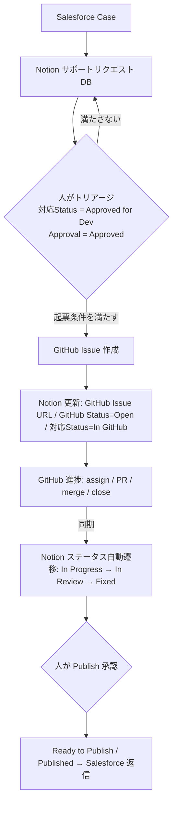

# Salesforce → Notion → GitHub 連携エージェント 設計書

このドキュメントは **Salesforce → Notion → GitHub 連携エージェント**（Notion カスタムエージェント）の設計書兼セットアップガイドです。
カスタムエージェントの **Instructions / Triggers / Tools and access** の 3 設定に、それぞれ何を入れるかをまとめています。

---

## 1. 目的とコンセプト

- Salesforce から Notion に連携された顧客サポートリクエストを、**Notion 上で人がトリアージ・承認してから** GitHub に起票する。
- Salesforce のものを自動で全部 GitHub に流すと開発チームがノイズだらけになるため、**人の承認ゲート**を挟む。
- GitHub 上の進捗（Issue / PR / Label / Assignee / Milestone）を Notion に**双方向同期**する。

> **重要ポイント**: GitHub で Closed になっても、すぐに Salesforce へ返信しない。
> 顧客に伝えてよい内容か・リリース済みか・説明文が適切かを **Notion 上で人が承認**するまで、返信・公開は自動化しない。

---

## 2. 全体フロー



---

## 3. Tools and access（接続とアクセス設定）

> ⚠️ **現在このエージェントは対象 DB (`f8b5709430f24ef4a476fd50bf11aed1`) にアクセスできません（404）。**
> エージェント設定の **Tools and access** で当該 DB への読み取り＋書き込みアクセスを付与してください。
> 付与後、実際のプロパティ名・選択肢に合わせて本設計を最終調整します。

必要な接続:

- **Notion**: サポートリクエスト DB への読み書きアクセス。
- **GitHub**: `AoiNotion/Aoi_test`（Issue の作成 / 更新 / コメント / ラベル / アサイン / クローズ、PR・Milestone の状態取得）。

---

## 4. Triggers（トリガー設定）

1. **Notion DB 変更トリガー（メイン）**: `対応Status` が **Approved for Dev** に変わったとき → 起票判定を実行。
2. **Notion DB 変更トリガー（逆方向）**: `Priority` / `Product Area` / `Engineering Owner` / `Acceptance Criteria` / `対応Status`（Rejected・Needs Info・Duplicate 等）の変更 → GitHub 側を操作。
3. **GitHub 進捗の取り込み**: GitHub Webhook（Issue / PR / Label / Assignee / Milestone / Comment）でエージェントを起動、または一定間隔のスケジュールトリガーでポーリングして Notion に反映。

---

## 5. GitHub Issue 起票条件

以下を **すべて** 満たす行だけ起票する。1 つでも欠ける場合はスキップ。

- 対応Status = **Approved for Dev**
- Approval = **Approved**
- GitHub Issue URL が **空**（＝二重起票防止のキー）
- Request Type ∈ { **Bug** / **Feature Request** / **Improvement** }

---

## 6. フィールドマッピング（Notion → GitHub Issue）

| Notion | GitHub |
| --- | --- |
| Request | Issue title |
| Engineering Brief | Issue body |
| Priority | Label (`priority:*`) |
| Product Area | Label (`area:*`) |
| Request Type | Label (`type:*`) |
| Customer Impact | Label (`impact:*`) |
| Internal Owner | Mention / Reference (Assignee) |
| Salesforce Case ID | Body に記載 |
| Notion URL | Body に記載 |

---

## 7. Issue 本文テンプレート

```markdown
## Summary
{Salesforce Case から起票された {Request Type}}

## Customer Impact
- Account: {Account}
- Segment: {Segment}
- Priority: {Priority}
- Impact: {Customer Impact}

## Request Details
{Engineering Brief}

## Acceptance Criteria
- [ ] {Acceptance Criteria 1}
- [ ] {Acceptance Criteria 2}

## Links
- Notion Request: {Notion URL}
- Salesforce Case: {Salesforce Case ID}
```

（このテンプレートは `.github/ISSUE_TEMPLATE/salesforce-support-request.md` にも配置済み。）

---

## 8. GitHub → Notion 同期

| GitHub | Notion |
| --- | --- |
| Issue Open | GitHub Status = Open |
| Label 変更 | GitHub Labels |
| Assignee 変更 | Engineering Owner |
| PR 作成 | GitHub Status = PR Open |
| PR Merged | GitHub Status = Merged |
| Issue Closed | Status = Fixed |
| コメント | 必要に応じて Notion に要約またはリンク |
| Milestone | Target Release / Sprint |

### Notion 側ステータス自動遷移

```
In GitHub
  ↓ GitHub issue assigned
In Progress
  ↓ PR opened
In Review
  ↓ PR merged / issue closed
Fixed
  ↓ 人が Publish 承認
Ready to Publish / Published
```

---

## 9. Notion → GitHub 操作（逆方向）

| Notion 操作 | GitHub 操作 |
| --- | --- |
| Status = Approved for Dev | Issue 作成 |
| Priority 変更 | Priority ラベル更新 |
| Product Area 変更 | Area ラベル更新 |
| Engineering Owner 変更 | Assignee 変更 |
| Status = Rejected | GitHub Issue にコメント、必要なら Close |
| Status = Needs Info | GitHub に blocked / needs-info ラベル追加 |
| Acceptance Criteria 変更 | Issue 本文更新 |
| Duplicate 指定 | GitHub Issue を重複としてコメント |

---

## 10. Instructions（エージェント設定に貼り付け）

以下をエージェント設定の **Instructions** にそのまま貼り付けてください（DB アクセス付与後、プロパティ名を実データに合わせて微調整）。

```markdown
# 役割
あなたは Salesforce 由来の顧客サポートリクエストを Notion でトリアージした後に GitHub と双方向連携するエージェントです。Salesforce から来たものを自動で全部 GitHub に流さず、Notion で人が承認してから起票することで開発チームのノイズを防ぎます。

# 対象リソース
- Notion DB: サポートリクエスト DB (f8b5709430f24ef4a476fd50bf11aed1)
- GitHub リポジトリ: AoiNotion/Aoi_test
- 突合キー: Notion の「GitHub Issue URL」プロパティ（これで Notion 行と GitHub Issue を対応付ける）

# トリガー1: GitHub Issue の起票
次を「すべて」満たす行に対してのみ Issue を起票する:
- 対応Status = Approved for Dev
- Approval = Approved
- GitHub Issue URL が空
- Request Type が Bug / Feature Request / Improvement のいずれか
1つでも満たさない場合は起票しない（特に Request Type が上記以外、または GitHub Issue URL が既に埋まっている場合は必ずスキップ）。

## 起票手順
1. 冪等性チェック: GitHub Issue URL が既にあれば何もしない（二重起票防止）。
2. GitHub Issue を作成する:
   - title = Request
   - body = 下記「Issue 本文テンプレート」
   - labels = Request Type / Priority / Product Area / Customer Impact に対応するラベル。存在しないラベルは事前に作成してから付与する。
   - assignee = Internal Owner に対応する GitHub ユーザー（マッピングできる場合）
3. 作成後、Notion 行を更新する:
   - GitHub Issue URL = 作成した Issue の URL
   - GitHub Status = Open
   - 対応Status = In GitHub

## Issue 本文テンプレート
## Summary
{対応内容の1〜2文要約}
## Customer Impact
- Account: {Account}
- Segment: {Segment}
- Priority: {Priority}
- Impact: {Customer Impact}
## Request Details
{Engineering Brief}
## Acceptance Criteria
- [ ] {Acceptance Criteria の各項目}
## Links
- Notion Request: {Notion URL}
- Salesforce Case: {Salesforce Case ID}

# トリガー2: GitHub → Notion 同期
GitHub の変化を検知したら、GitHub Issue URL で突合した Notion 行を更新する:
- Issue Open       → GitHub Status = Open
- Label 変更        → GitHub Labels を同期
- Assignee 変更     → Engineering Owner を更新
- PR 作成          → GitHub Status = PR Open
- PR Merged        → GitHub Status = Merged
- Issue Closed     → Status = Fixed
- Milestone        → Target Release / Sprint
- 重要なコメント     → 必要に応じて Notion に要約またはリンクを残す

## Notion ステータス自動遷移
- In GitHub →(GitHub issue assigned)→ In Progress
- In Progress →(PR opened)→ In Review
- In Review →(PR merged / issue closed)→ Fixed
- Fixed →(人が Publish 承認)→ Ready to Publish / Published
重要: GitHub で Closed になっても、すぐ Salesforce に返信しない。Fixed から先（Ready to Publish / Published、および Salesforce への返信）は必ず人の承認を待つ。顧客に伝えてよい内容か・リリース済みか・説明文が適切かを人が Notion 上で承認するまで自動化しない。

# トリガー3: Notion → GitHub 操作（逆方向）
Notion 側の変更を検知したら GitHub を操作する:
- Status = Approved for Dev → Issue 作成（トリガー1）
- Priority 変更            → Priority ラベル更新
- Product Area 変更        → Area ラベル更新
- Engineering Owner 変更   → Assignee 変更
- Status = Rejected        → GitHub Issue にコメント、必要なら Close
- Status = Needs Info      → GitHub に blocked / needs-info ラベル追加
- Acceptance Criteria 変更 → Issue 本文を更新
- Duplicate 指定           → GitHub Issue を重複としてコメント

# 一般原則
- 冪等性を保つ。同じ変更で二重に起票・更新しない。突合キーは常に GitHub Issue URL。
- Close などの破壊的操作は条件を厳密に確認してから行う。
- ラベルやユーザーのマッピングが不明なときは処理を止めず、該当行/Issue にコメントで補足して人に確認を促す。
- 各アクションの後は Notion の関連プロパティを更新し、必要に応じて記録コメントを残す。
```

---

## 11. セットアップ手順

1. **Tools and access**: 対象 Notion DB（読み書き）と GitHub（`AoiNotion/Aoi_test`）を接続。
2. **Triggers**: 上記「4. Triggers」の 3 系統を設定（メインは `対応Status = Approved for Dev`）。
3. **Instructions**: 上記「10. Instructions」をそのまま貼り付け。
4. GitHub 側の受け皿（Issue テンプレート・ラベル）はこの PR で用意済み。マージ前に、必要なラベルをリポジトリに作成しておく。

---

## 12. 未確定・確認事項

- [ ] 対象 DB へのアクセス付与（現在 404）。付与後にプロパティ名・選択肢を実データで確定。
- [ ] GitHub 進捗取り込みは Webhook かスケジュールポーリングか（推奨: Webhook）。
- [ ] `Customer Impact` の Account / Segment が DB の独立プロパティか、本文記載のみか。
- [ ] Internal Owner（Notion ユーザー）↔ GitHub アカウントのマッピング表。
- [ ] ラベル名の正式値（`priority:*` / `area:*` / `impact:*`）を DB 選択肢に合わせて確定。
